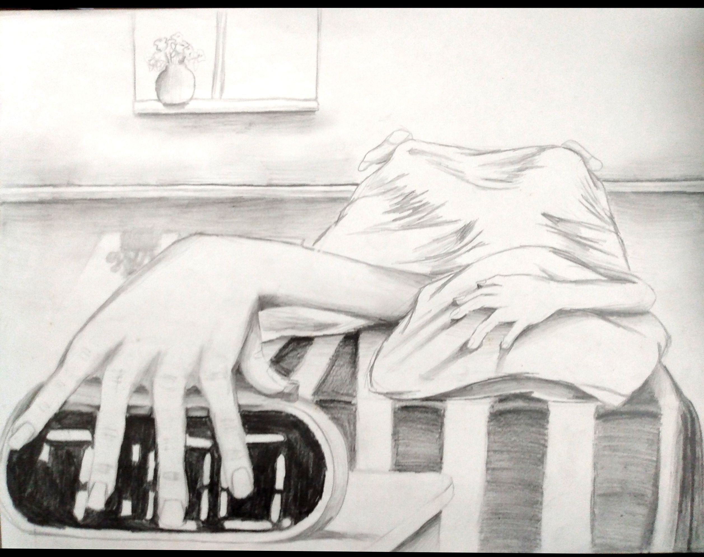

Although the café was modern and casual, it carried a classy vintage feel. The walls were a comforting shade of dark blue. Elaborate white molding and eclectic pieces of art made the color fade into the general background.

*All media on this page has been created by [me](https://arcadiapage.com/aboutme/#the-studio-at-blue-pearl-lake). Please use appropriate attribution when sharing. Thank you 💙*

{: .mx-auto.d-block :}

{: .mx-auto.d-block :}

One of the sitting areas also doubled as a temporary stage. The first time I saw Kami, she was standing there playing a mellow coffee shop song on her guitar and singing into an old style microphone. You know which one I’m talking about, the one molded out of metal.🎙️

[Coffee Shop Song](https://voca.ro/1nPv2hEmsBPT
)

<iframe width="300" height="60" src="https://vocaroo.com/embed/1nPv2hEmsBPT?autoplay=0" frameborder="0" allow="autoplay"></iframe>

{: .mx-auto.d-block :}

{: .mx-auto.d-block :}

{: .mx-auto.d-block :}

💿[The Wind Whispers](https://voca.ro/1lGW8QXFqKnQ)

<iframe width="300" height="60" src="https://vocaroo.com/embed/1lGW8QXFqKnQ?autoplay=0" frameborder="0" allow="autoplay"></iframe>

{: .mx-auto.d-block :}

{: .mx-auto.d-block :}

{: .mx-auto.d-block :}

I sat at a table that was in clear view of the makeshift stage. She stepped away from the microphone and held on tightly to her guitar as you came on stage and whispered into her ear.

At first, I didn’t pay much attention to you. You were wearing a dark blue apron over a white collared shirt—you looked like another employee. Then I remembered that you weren’t the girl I saw working behind the counter.

You tucked your shoulder length black hair behind one of your ears. Your golden eyes sparkled as you smiled at us. I think it’s interesting how you have a thing for unusual contact lenses. Then gripping the microphone even tighter, with your neon yellow and black nails clashing against the silver, you began to sing.

{: .mx-auto.d-block :}

💿[Daydreamers](https://voca.ro/1et46LSkMmYL)

<iframe width="300" height="60" src="https://vocaroo.com/embed/1et46LSkMmYL?autoplay=0" frameborder="0" allow="autoplay">

{: .mx-auto.d-block :}

{: .mx-auto.d-block :}

I have to say Amelie, you’re not a real singer. Still, you have so much energy and honesty when you're in front of everyone; I want to believe that you are. 

The moment I saw you singing, I wished I could live as truthfully as you. I wanted to slip into your cocoa brown skin and live as you for awhile. I wanted to escape the glass vault I was trapped in.

